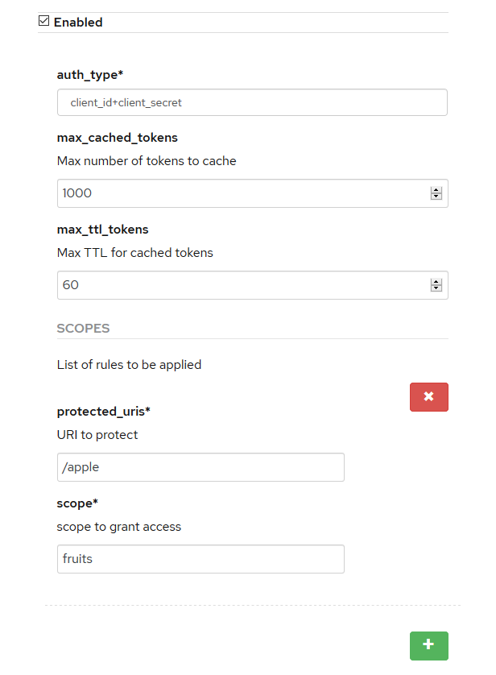

# APIcast Custom Policy
# Token Introspection with Scopes

This policy was customized from the official Token Introspection Policy


# How to use
create a custom policy in your 3scale Api Manager:

```
$ curl -v -X POST -u ":{3SCALE_ACCESS_TOKEN}" -H "Content-Type: application/json" \
    -d @policy-registry-item.json \
    https://{ADMIN_PORTAL}/admin/api/registry/policies.json
```

Add the custom policy in your policy chain and configure as below:



Run a oauth2 server
```
$ docker run -it -d -p 9443:9443 wso2/wso2is
```

1. Access https://localhost:9443/carbon and login with admin/admin credentials
2. Add a service provider with any name
3. Uncheck "Code" and "Implicit" in (Inbound Authentication Configuration)->(OAuth/OpenID Connect Configuration)->(Configure)
4. Save this configuration with "add" button
5. Copy the "OAuth Client Key" and "OAuth Client Secret" and paste in env.sh file

Try create a token:
```
source env.sh
curl -X POST --basic -u $CLIENTID:$CLIENTSECRET -H "Content-Type: application/x-www-form-urlencoded;charset=UTF-8" -k \
-d "grant_type=password&username=$USERNAME&password=$PASSWORD&scope=$SCOPE" $TOKEN_EP
```

Save the Token in a variable
```
export TOKEN={YOUR_TOKEN}
```

Run APICast with this custom policy
```
podman run --name apicast --rm -p 80:8080 -v $(pwd)/token_introspection_with_scopes/:"/opt/app-root/src/policies/OAuth 2.0 Token Introspection with Scopes/0.3/" -e APICAST_LOG_LEVEL=info -e THREESCALE_DEPLOYMENT_ENV=staging -e THREESCALE_PORTAL_ENDPOINT=https://{3SCALE_ACCESS_TOKEN}@{ADMIN_PORTAL} quay.io/3scale/apicast:master
```
Modify your /etc/hosts with the url of your apicast and 127.0.0.1
          
Test the API
```
curl -H "Authorization: Bearer $TOKEN" "http://apicast.acme.com:80/herico?user_key=9caa21018e0aa9c96786ae4fff88169d"
```
Its works because the path "/herico" is not a "protected_uris"
```
curl -H "Authorization: Bearer $TOKEN" "http://apicast.acme.com:80/apple?user_key=9caa21018e0aa9c96786ae4fff88169d"
```
Its not works because my Token was creates without the scope fruits


Lets try again with the authorized scope:
```
export SCOPE=fruits
curl -X POST --basic -u $CLIENTID:$CLIENTSECRET -H "Content-Type: application/x-www-form-urlencoded;charset=UTF-8" -k \
-d "grant_type=password&username=$USERNAME&password=$PASSWORD&scope=$SCOPE" $TOKEN_EP
export TOKEN={YOUR_NEW_TOKEN}

curl -H "Authorization: Bearer $TOKEN" "http://apicast.acme.com:80/apple?user_key=9caa21018e0aa9c96786ae4fff88169d"
```
Its Works!

